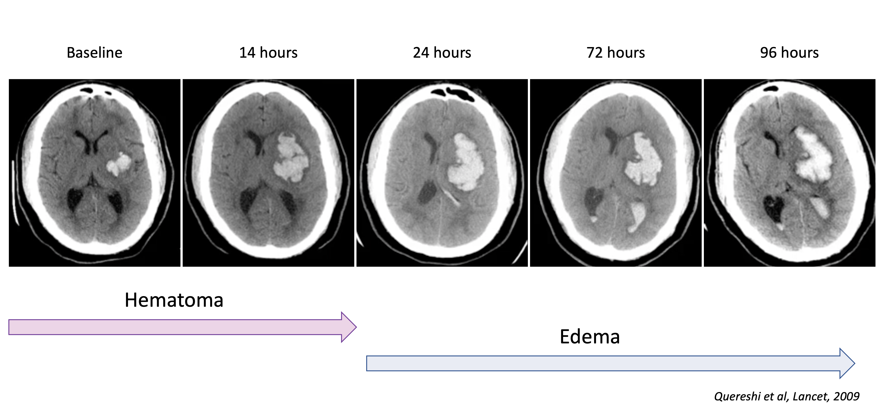

### Clinical question

In patients with spontaneous intracerebral hemorrhage (ICH), does a bundle of intensive blood pressure lowering (target systolic BP <140 mm Hg within 1 hour), protocolized glucose and temperature control as well as reversal of anticoagulation improve reduce the risk of death or severe disability as compared to non protocolized standard of care?

_This article will mainly focus on the blood pressure lowering aspect of the trial._

### Pathophysiological considerations 

The early hours after ICH are characterized by balance act between hematoma expansion and maintaining cerebral perfusion.

_Hematoma expansion_
- Hematoma expansion is a major determinant of outcome in ICH
- Most hematoma expansion occurs within 3 hours of onset
- Hypertension is a major risk factor for hematoma expansion

_Acute hypertensive response_
- Hypertension is frequently observed in the acute phase of ICH
- Hypertension could be a autoregulatory response to maintain cerebral perfusion
- Peri-hematoma penumbra seems to be a myth, as perihematomal tissue as proportionally reduced metabolism and perfusion

The later stages seem to be driven by secondary injury, such as edema (both focal and global), inflammation and oxidative stress.

## Prior evidence 

_RCTs_
* INTERACT1 2008 -- n=404, <140 vs <180mmHg, BP goals barely met, possibly less hematoma growth
* ATACH1 2010 -- n=60 IV anti-hypertensive, BP goals achieved
* INTERACT2 2013 -- n=2839, BP goals barely met, no diff in hematoma expansion, no diff in primary (mrs >3), tendancy toward better mrs
* ATACH2 2016 -- n=1000 (stopped for futility), BP goals achieved, trend toward reduced hematoma expansion, no diff in outcome, more AKI
* AHA/ASA guidelines 2022: lowering systolic BP (SBP) to a target range of 130 to 140 mmHg is safe and may be reasonable

_Bundle trials_
* Quality in Acute Stroke Care trial 2011 -- n=1696 (hemorrhagic & ischemic), pre/post analysis, large mortality benefit (-16%)
   * Bundle: management of fever / hyperglycemia / swallowing
* ICH ABC Bundle 2019 -- n= 973, pre/post analysis, UK, large mortality benefit (-11%)
    * Bundle: Anticoagulation reversal, <140mmHg, referral to NCH
  

_Main critiques of prior trials:_
* Achieved BP goals differed between trials (INTERACT2: 140mmHg, ATACH2: 110mmHg)
* Outcome should be assessed at 6 months, not 3 months (as traditionally done in stroke trials) 

_Gist:_ Meta-analyses found an overall benefit (shift in ordinal mRS scale) of intensive BP lowering in ICH and guidelines started mentioning / recommending a target of 130-140mmHg. 

## INTERACT3
### Population

_Site inclusion criteria_
- No existing protocol for BP lowering
- Local champion

_Patient inclusion criteria_
- \> 18y
- Spontaneous ICH, confirmed by CT
- ≤ 6 hours from onset

_Patient exclusion criteria_
- Evidence that ICH is secondary to AVM / aneurysm / trauma / ichemic stroke / lysis
- High likelihood that patient will not adhere to treatment / follow-up

Screening: continuous of all arriving patients (controlled by trial staff)

Participating countries: Brazil, China, India, Mexico, Nigeria, Pakistan, Peru, Sri Lanka, Viet Nam, Chile 

_Why?_
- Probably no equipoise in high-income countries or existing protocols
- High & rising prevalence of hypertension and ICH in LMICs
- Trial powered by the George Institute, realising large studies, targeting global health issues (with an established trial network)

### Trial design

Stepped wedge cluster randomized trial: each sites starts with standard of care, then switches to intervention at after a certain number of periods (1-3), as allocated by site-level randomisation.

Period: 3-4 months, or until a certain (variable) number of patients were enrolled

_Comments:_
- _highly variable period lengths between clusters_
- COVID pandemic fell in middle, with stopped recruitement in some countries -> later phases were extended
- Advantages: allows for fast intervention (no need to wait for patient to be randomized), and testing implementation of protocol

### Intervention

_Bundle_
- Target SBP 130-140mmHg 
- Target INR < 1.5 
- Glucose control 
   - Non-diabetic: 6.1-7.8 mM 
   - Diabetic: 7.8-10.0 mM
   - _Comment:_ very tight range, lower than NICE-SUGAR (<10) & Quality in acute stroke care (< 11), higher than Leuven trials (4.4-6.1)
- Temperature control: < 37.5°C

Targets were to be achieved within 1h, and maintained for 7d.

_Protocol implementation_
- Before intervention: 7-10d online training 
- During intervention: 
  - Center specific protocol (targeted to available drugs)
  - Monitoring of SBP / INR / glycemia / temperature (trial staff)
  - Monthly feedback 
  - 2 QI Meetings

### Outcomes

_Primary outcome_: ordinal shift on modified Rankin Scale (mRS) at 6 months

_Main secondary outcomes_: mRS ≤ 2 vs ≥ 3, mortality, quality of life, residence

_Safety Outcomes_: serious adverse events (self reported, only if life-threatening / disability / or triggering readmission / prolongation)

_Assessment_: by phone by “blinded” personnel (central office only in China / Chile / Brazil / Nigeria) - otherwise located at hospitals (who probably knew the current protocol being applied)

### Results
#### Trial conduct

_Recruitment:_ 121 sites, 7036 patients randomized
- 30% patients excluded upon screening, but adequate reasons (mostly presentation > 6h, no consent, structural cause)
- Minimum 8% lost to follow-up & 11% with no primary outcome data
- --> Slightly underpowered (planned for 90% power: 110sites, 8360 patients)

_Population:_ Randomisation worked, well-balanced between groups
- at baseline: compared to Swiss ICH patients, these patients tended to be ~10y younger (62y), fitter (77% pre-mRS 0), and with less AF / D2 / coronary disease, but similar level of hypertension
- at presentation: TAS 175 mmHg, moderately severe neuro deficit (NIHSS 13), GCS 12
  - Only very few with altered T° / INR (<2%)

_Intervention (BP):_ Small but significant difference in SBP between groups
- on average: target achieved at 4h vs 8h
- at 1h: 150 vs 160mmHg
- Main agents used
  - IV: urapidil (60%), nicardipine (8.5%), sodium nitroprusside, labetalol, nimodipine, very little clevidipine (~2%)
  - PO: ACEi (~60%), CCB (~76%) 
- Compared to prior trials:
  - Less intensive than ATACH2 (which had shown an increase in AKI) 
  - More than INTERACT2 

_Intervention (rest of bundle)_: no significant separation between groups

#### Outcomes

_Primary outcome_: favorable shift in mRS in intervention group (OR 0.86; 95% CI 0.76-0.97, p=0.015), consistent across all adjustments/calculations
- Statistical calculation of primary outcome had to be changed post-protocol. Initially it was planned to adjust for time passing by correcting for (= using as fixed factor) period, however as the period length varied a lot, this resulted in a non-significant primary outcome (probably because of correlation between intervention assignment and period). The authors changed this to correcting for time by using calendar time periods. To a statistical novice, this seems to be okay.
- Size in shift in primary outcome not very impressive, with notably less mRs 0 & more mRs 3?

_Secondary outcomes_: all strictly non-significant, but trends consistent with primary outcome
- notably adjusted risk of death 11% vs 14% (not significant)

_Subgroups_: trends consistent across subgroups, no clear effect modifiers

_Safety outcomes_: reported reduced adverse events
- gross prevalence seems under-reported (ex pneumonia prevalence after ICH should be 10-60%)
- a reduction in probably unrelated adverse events is reported (e.g. gastro-intestinal disorders)
- no diff. in AKI, but probably underreported as this was not systematically assessed

_Other:_ no difference in hematoma expansion

### Assessment

_Weaknesses_
- Small effect in primary outcome
- Generalizability? Mostly China & LMICs, patients with no anti-coagulation 
- Not fully blinded (outcome assessment was probably not blinded in some sites)
- Outcome assessment by phone 
- Bundle: Although BP was most prominent aspect, effect of other interventions cannot be excluded
- Hawthorne effect: sites were aware of being in a trial, and were probably more attentive to patient care when in the bundle phase
- Renal side effects not systematically assessed

_Strengths_
- Large international, well conducted RCT
- Pragmatic bundle, large scale implementation
- Relevant global health issue

_Interpretation_
- Bayesian: given a probable a priori beneficial effect of BP lowering, this trial provides further evidence for a beneficial effect of intensive BP lowering in ICH
- Probably an absolute small effect (~-2-3% mortality), but applied on large scale
- Implementation of a bundle/guideline should be recommended, as it carries further benefits
  - organising care & promoting monitoring
  - defining goals & interventions renders a disease without hope more manageable, and thus probably improves care
  - highlights urgency of hemorrhagic stroke - time is brain
- Exact mechanism of benefit of BP lowering is still unclear (no diff. in hematoma expansion)

_Bottomline_: Bundle of intensive BP lowering (target 130-140mmHg), glucose & temperature control, and reversal of anticoagulation in ICH patients improves outcomes.

### Adapted algorithm for ICH management

### References:

1. Greenberg, S. M. et al. 2022 Guideline  for  the  Management  of  Patients  With  Spontaneous  Intracerebral  Hemorrhage: A Guideline  From  the American Heart  Association/American Stroke  Association. Stroke 53, e282--e361 (2022).

2. Qureshi, A. I. Acute  Hypertensive  Response  in  Patients  With  Stroke. Circulation 118, 176--187 (2008).

3. Parry-Jones, A. R. et al. An  Intracerebral  Hemorrhage Care Bundle  Is  Associated  with  Lower  Case  Fatality. Ann  Neurol 86, 495--503 (2019).

4. Investigators, A. T. of A. C. H. (ATACH). Antihypertensive  treatment  of  acute  cerebral  hemorrhage*. Critical Care Medicine 38, 637 (2010).

5. Moullaali, T. J. et al. Blood  pressure  control  and  clinical  outcomes  in  acute  intracerebral  haemorrhage: a preplanned  pooled  analysis  of  individual  participant data. The  Lancet  Neurology 18, 857--864 (2019).

6. Yu, K., Sun, Y., Guo, K., Peng, J. & Jiang, Y. Early  blood  pressure  management  in  hemorrhagic  stroke: a meta-analysis. J  Neurol 270, 3369--3376 (2023).

7. Moullaali, T. J. et al. Early  lowering  of  blood  pressure  after  acute  intracerebral  haemorrhage: a systematic  review  and meta-analysis  of  individual  patient data. J  Neurol  Neurosurg  Psychiatry 93, 6--13 (2022).

8. Anderson, C. S., Selim, M. H., Molina, C. A. & Qureshi, A. I. Intensive  Blood  Pressure  Lowering  in  Intracerebral  Hemorrhage. Stroke 48, 2034--2037 (2017).

9. Anderson, C. S. et al. Intensive  blood  pressure  reduction  in  acute  cerebral  haemorrhage  trial (INTERACT): a randomised  pilot  trial. Lancet  Neurol 7, 391--399 (2008).

10. Qureshi, A. I. et al. Intensive  Blood-Pressure  Lowering  in  Patients  with  Acute  Cerebral  Hemorrhage. New  England  Journal  of  Medicine 375, 1033--1043 (2016).

11. Song, L. et al. INTEnsive care bundle  with  blood  pressure  reduction  in  acute  cerebral  hemorrhage  trial (INTERACT3): study  protocol  for a pragmatic  stepped-wedge  cluster-randomized  controlled  trial. Trials 22, 943 (2021).

12. Qureshi, A. I., Mendelow, A. D. & Hanley, D. F. Intracerebral  haemorrhage. The  Lancet 373, 1632--1644 (2009).

13. Anderson, C. S. et al. Rapid  Blood-Pressure  Lowering  in  Patients  with  Acute  Intracerebral  Hemorrhage. New  England  Journal  of  Medicine 368, 2355--2365 (2013).

14. Burns, J., Fisher, J. & Cervantes-Arslanian, A. Recent  Advances  in  the  Acute  Management  of  Intracerebral  Hemorrhage. Neurosurgery  Clinics  of  North America 29, 263--272 (2018).

15. Ma, L. et al. The  third  Intensive Care Bundle  with  Blood  Pressure  Reduction  in  Acute  Cerebral  Haemorrhage  Trial (INTERACT3): an  international, stepped  wedge  cluster  randomised  controlled  trial. The  Lancet 402, 27--40 (2023).

Lectures: „Evidence  based  management  of  intracerebral  hemorrhage - An  update", AI Quereshi, 2022

FOAM: INTERACT3, The  sceptics  guide to emergency  medecinte. Pallaci & Hunter.

