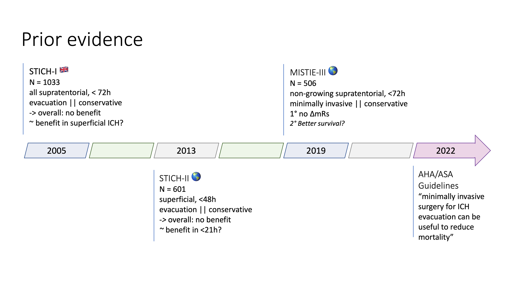
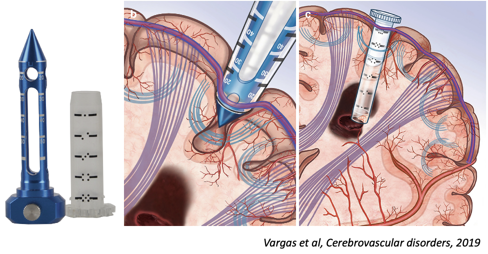
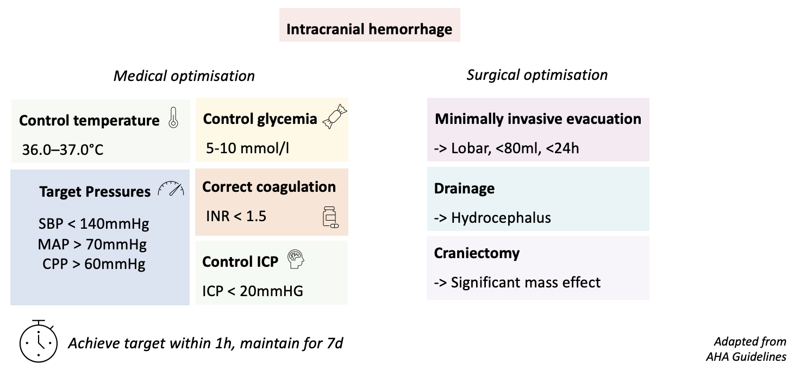
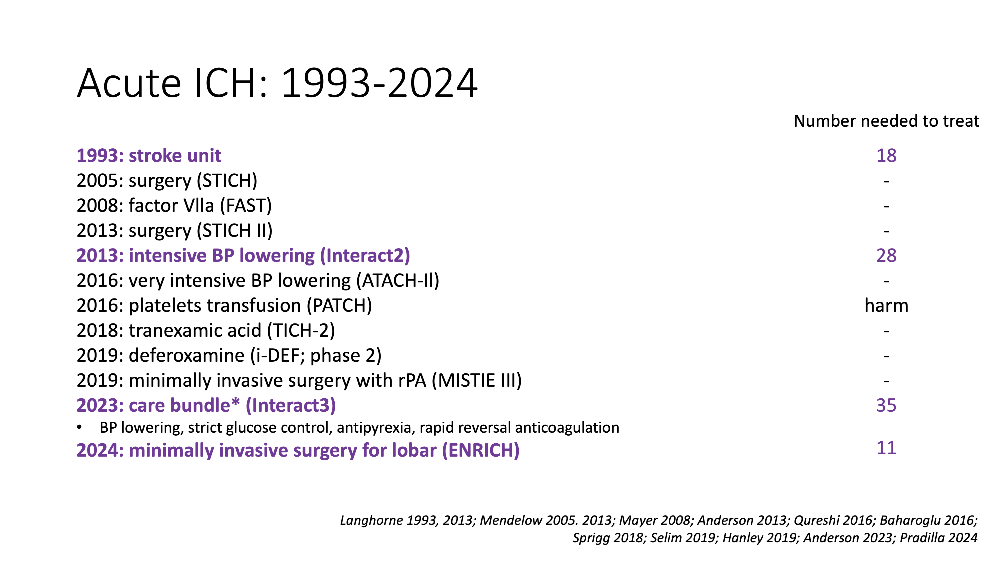

### Clinical question

In patients with spontaneous intracerebral hemorrhage (ICH), does early minimally invasive surgical removal reduce the risk of death or severe disability as compared to medical management?

### Pathophysiological considerations 

_Hematoma expansion_
- Hematoma expansion is a major determinant of outcome in ICH
- Most hematoma expansion occurs within 3 hours of onset
- Hypertension is a major risk factor for hematoma expansion

_Edema and inflammation_
- secondary injury is driven by edema (both focal and global), inflammation and oxidative stress

_ICP elevation_
- both hematoma volume and edema contribute to ICP elevation

## Prior evidence 

Standard evacuation
* STICH-I 2005 -- n=1033 (UK), all supratentorial, < 72h, evacuation vs. conservative, overall no benefit, potential benefit in superficial ICH (< 1cm from surface)
* STICH-II 2013 -- n=601 (Worldwide), superficial, <48h, evacuation vs. conservative, overall no benefit, potential benefit in <21h 
  * max 100ml and no intraventricular hemorrhage

Minimal invasive evacuation
* MISTIE-III, 2019 -- n=506 (Worldwide), non-growing supratentorial, <72h, minimally invasive vs. conservative, overall no benefit, potential survival benefit 
  * acute bleeding excluded, insufficient clot evacuation

AHA 2022 guidelines
- Class IIb recommendation for minimally invasive surgery for ICH evacuation for reduction of mortality

_Main critiques of prior trials:_
* early trials (STICH-I / II) too destructive
* interventions too late
* volume of evacuation too small

## ENRICH trial
### Population

_Patient inclusion criteria_
- 18-80y
- Spontaneous supratentorial ICH
- hematoma volume 30-80ml on CT
- GCS 5-14, NIHSS > 5
- prior mRS 0-1
- surgery possible within 24h of las known well

_Patient exclusion criteria_
- long-term anticoagulation
- uncorrectable coagulopathy
- _very poor or very good_ neurological examination
- infratentorial & thalamic ICH
- intraventricular hemorrhage > 50% of lateral ventricle

Screening: 
All ICH

Goal: 
- early intervention (< 24h)
- active bleeding not an exclusion criteria

### Trial design

Design: open label, parallel group, superiority randomized controlled adaptive trial

Period: 2016-2022
Location: US, 37 centers
Two subgroups: lobar and anterior basal ganglia

Randomisation: 1:1
Adaptive design:
- interim analyis planned at 150, 175, 200, 225, 250, and 275 patients
- possible adaptive decisions: stop in either the anterior basal ganglia or the lobar location, stop for all, or continue for all

### Intervention

craniotomy, imaging-guided trajectory w/ BrainPath port, Suction evacuation

Comments:
- planning for white matter tract preservation (Software by Nico corporation)

### Outcomes

_Primary outcome_: utility-weighted modified Rankin Scale (mRS) at 6 months

_Main secondary outcomes_: 
- significant post-operative rebleeding (>+ 4 pts on NIHSS or -2pts on GCS)
- Length of stay
- mRS at 7 days / discharge / 30 days / 90 days
- survival at 6 months

_Safety Outcomes_: 
- death at 30 days
- change in hematoma volume

_Assessment_: 
- audio-recorded structured interview at 30, 90, and 180 days
- assessment of outcome by blinded neuropsychologist

### Results
#### Trial conduct

_Recruitment:_ 37 sites, 300 patients, 6 years
- highly selected population, **_only 2.5%_** of screened patients included
- lost to follow-up: 5%

Adaptation triggerred: After 175 patients, the trial was stopped for the anterior basal ganglia location

_Population:_
- globally well-balanced among groups
- representative of Western ICH population
- only 20% of prior mRS =< 1 ?? (seems like an error in Table 1, as the inclusion criteria was mRS 0-1)

_Intervention:_ 
- median time to surgery: 16.7h  
- remaining hematoma volume: 15ml

#### Outcomes

_Primary outcome_: significant difference in utility weighted mRS at 6 months (0.45 vs 0.37, posterior probability of superiority 0.98)
- mainly driven by the lobar subgroup (0.51 vs 0.37)
- no effect in the anterior basal ganglia subgroup (0.34 vs 0.37)

_Secondary outcomes_: 
- Distribution of mRs shift: evenly distributed over all categories (not only increase in survival)
- globally all secondary outcomes were in favor of the intervention, notably:
  - reduced ICU and hospital length of stay
  - reduced time on the ventilator
  - less salvage craniectomy (3% vs 20%)
- Difference in mRs =< 3 and mortality with numerical benefit for intervention, but not significant
  - this could be mainly driven by a lack of power (trial was designed to detect change of overall shift, not individual categories of mRS) 

_Subgroups_: 
- Main benefit in: patients >= 65y, lobar location, GCS 9-14 (and more benefit in women?)

_Safety outcomes_: 
- globally less adverse events in the intervention group
- notably fewer pneumonia (although number of respiratory failure events was similar), less cerebral edema and less secondary ICH

### Assessment

_Weaknesses_
- Highly selected population: only 2.5% of screened patients included (this was confirmed by recent feasibility exploration in Sweden[^2])
- Single technique: other minimally invasive techniques were not explored (SCUBA endoscopic techniques are also currently developed) 
  - Not clear if the benefit is from the instruments or the guidance provided by the software 
  - The trial was sponsored by Nico corporation - although no interference was reported, the potential for bias is present
- Generalisation outside US? although the authors show that a variety of centers were included (and the brain port could be mimicked by a 50cc seringue), the generalisation to other countries is not clear
- «minimally» invasive: the brain port is still of significant size 
- Primary bayesian analysis, making interpretation and back-checking of statistics more difficult
  - design and statistics was outsourced to a statistics company 
- Medium size trial (300 patients)

_Strengths_
- First ever positive trial for supratentorial ICH 
- Extremely well-designed RCT
- Blinding was done as much as possible

_Interpretation_
- effect on outcomes is clinically significant (seems to be not only driven by survival at the expense of severe disability) 
- the benefit is mainly driven by the lobar subgroup 
- in the anterior basal ganglia subgroup, no conclusion can be drawn

_Bottomline_: 
In patients with lobar ICH, minimally invasive surgery within 24h of onset improves outcome at 6 months. 

_Open questions_:
- is the benefit driven by the planning software or the technique?
- is this small population worth the investment in the technique?

### Adapted algorithm and state of the evidence

### References:

[^1]: Pradilla Gustavo, Ratcliff Jonathan J., Hall Alex J., Saville Benjamin R., Allen Jason W., Paulon Giorgio, et al. Trial of Early Minimally Invasive Removal of Intracerebral Hemorrhage. New England Journal of Medicine. 2024 Apr 10;390(14):1277–89.

[^2]: Apostolaki-Hansson T, Hillal A, Göransson N, Hansen BM, Norrving B, Ramgren B, et al. The potential for minimally invasive intracerebral hemorrhage evacuation in routine healthcare: applicability of the ENRICH trial criteria to an unselected cohort. Front Stroke. 2024 May 17;3.