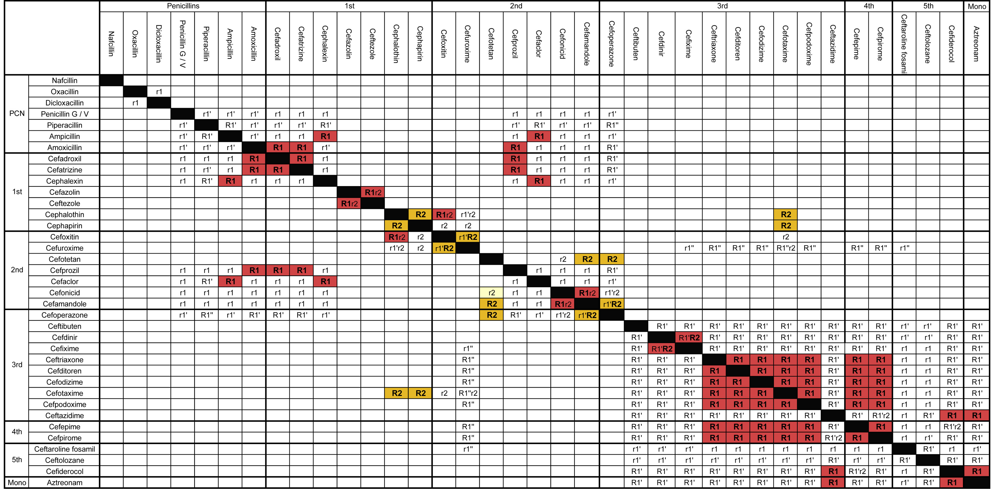

Allergies aux beta-lactames, concepts, conséquences et stratégies. 

<iframe src="https://docs.google.com/presentation/d/e/2PACX-1vQNo0Tq8f7WW_YN0JaoSFHKZ2G3BI0ZZkMRzMQMjFYsPAB4MRP520YWwO5GJiYQpp7p1WcoRwuTwqFQ/embed?start=false&loop=false&delayms=3000" frameborder="0" width="960" height="569" allowfullscreen="true" mozallowfullscreen="true" webkitallowfullscreen="true"></iframe>

Blumenthal K, J Allergy Clin Immunol 2017
-

Zagursky RJ, J Allerg Clin Immunol Pract 2018
-
